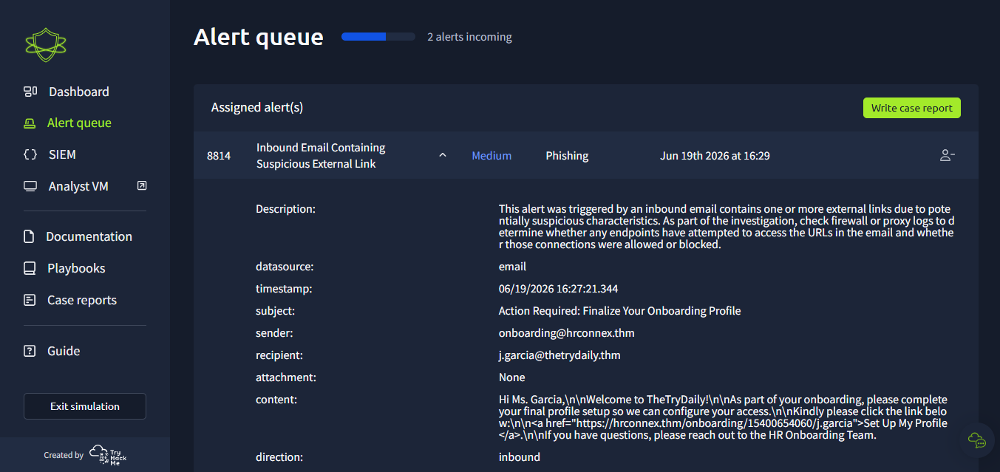
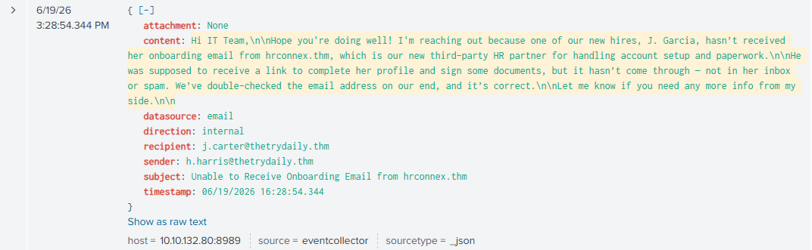
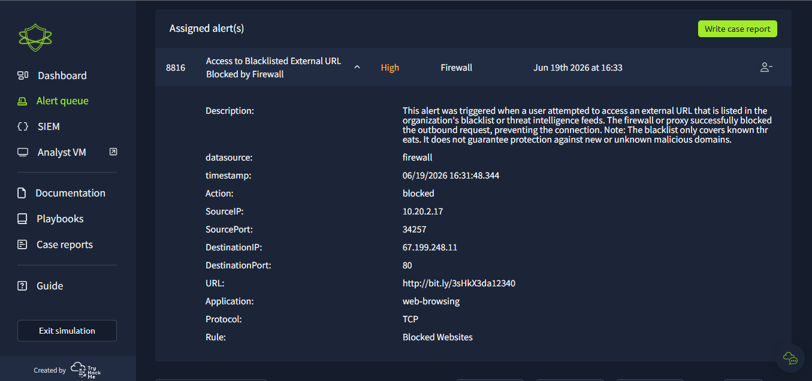
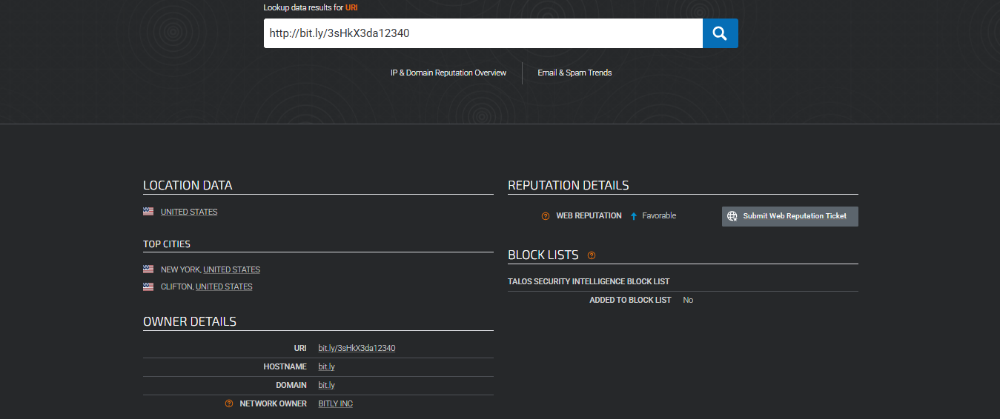
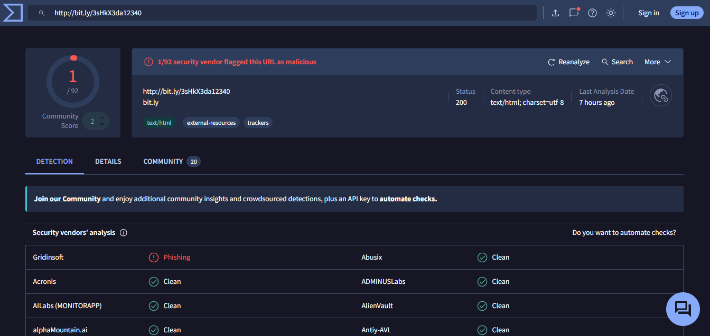
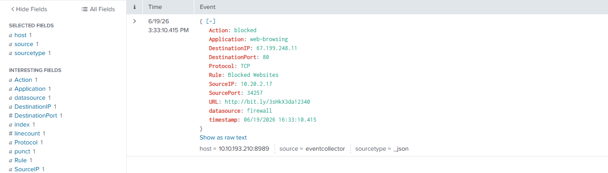
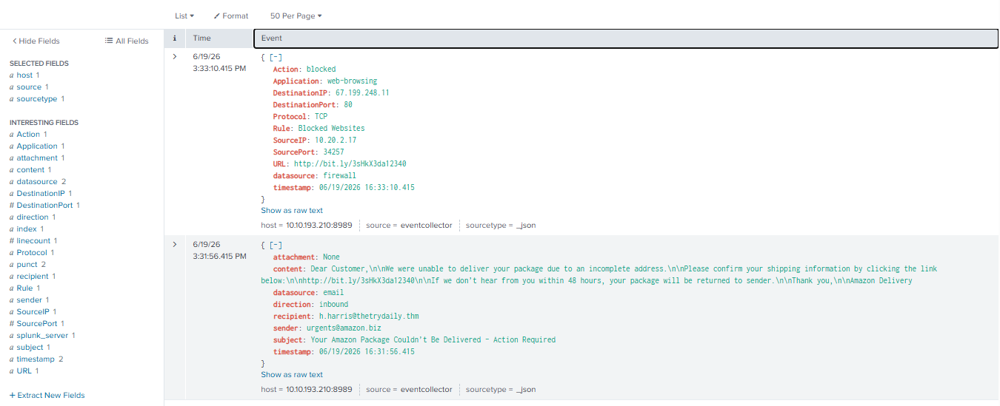

# 🛡️ SOC Investigation Lab: Phishing Triaging & SIEM Correlation with Splunk

## Introducción
Este repositorio contiene la documentación y el análisis técnico de incidentes gestionados en un entorno simulado de Centro de Operaciones de Seguridad (SOC) de TryHackMe. El objetivo principal de la investigación fue realizar el triaje de alertas de correo electrónico entrante en una cola de incidentes, investigar los Indicadores de Compromiso (IOCs) mediante herramientas externas de reputación y correlacionar la telemetría utilizando **Splunk** para determinar el impacto real en los endpoints de la organización.

---

## Habilidades y Herramientas Demostradas
* **SIEM:** Splunk (Búsqueda, filtrado y correlación cruzada de eventos de red y correo).
* **Análisis de Logs:** Interpretación de estructuras JSON provenientes de fuentes de correo y firewalls.
* **Investigación de Amenazas:** Uso de VirusTotal y Cisco Talos Intelligence; identificación de tácticas de ingeniería social (*Typosquatting*).
* **Gestión de Alertas:** Clasificación técnica de incidentes (Falsos Positivos frente a Verdaderos Positivos).

---

## Caso 1: Análisis de Falso Positivo (Plataforma HR)

### Alerta Inicial
La cola de alertas detectó un evento relacionado con un enlace externo sospechoso entrante.

* **ID de Alerta:** 8814
* **Regla:** Inbound Email Containing Suspicious External Link
* **Gravedad:** Medium
* **Remitente:** `onboarding@hrconnex.thm`
* **Destinatario:** `j.garcia@thetrydaily.thm`

### Investigación y Análisis de Logs
Al inspeccionar los registros indexados en Splunk para el dominio `hrconnex.thm`, se localizó el flujo de correos asociados. Durante el análisis, se interceptó un correo interno enviado por un miembro del equipo (`h.harris@thetrydaily.thm`) informando a soporte que una nueva contratación no había recibido sus accesos desde el dominio externo en cuestión. En dicho mensaje se aclara explícitamente que `hrconnex.thm` corresponde al proveedor externo oficial de Recursos Humanos de la empresa para la gestión de onboarding y trámites de contratación.

Además, la auditoría del panel lateral en Splunk confirmó que el campo `datasource` presentaba un valor de `1` (únicamente registros de tipo `email`), validando la ausencia completa de logs en el Firewall de la compañía, lo que demuestra que no existieron conexiones web salientes ni interacciones anómalas por parte de los usuarios.

### Conclusión y Cierre
* **Veredicto:** **Falso Positivo (False Positive)**
* **Justificación:** El dominio analizado es legítimo y pertenece al flujo operativo de la organización. La alerta fue disparada por firmas genéricas automatizadas del gateway de correo. No representa ningún peligro.
* **Recomendación:** Agregar el dominio `hrconnex.thm` a la lista blanca (*whitelist*) del gateway de correo institucional para mitigar futuras falsas alarmas recurrentes.

---

## Caso 2: Phishing de Amazon - Verdadero Positivo Mitigado

### Alerta Inicial
El sistema detectó una alerta de correo electrónico simulando de forma urgente un problema con la entrega de un paquete.

* **ID de Alerta:** 8815
* **Regla:** Inbound Email Containing Suspicious External Link
* **Remitente:** `urgents@amazon.biz`
* **Destinatario:** `h.harris@thetrydaily.thm`
* **Enlace Identificado:** `http://bit.ly/3sHkX3da12340`

### Investigación de Amenazas (IOCs)
Se analizó el contenido y los metadatos del correo entrante, detectando indicadores claros de suplantación de identidad utilizando un dominio falso (`amazon.biz`) y un enlace acortado para enmascarar el destino original.

Para complementar la investigación, se consultaron plataformas de inteligencia de amenazas. El análisis en **VirusTotal** y **Cisco Talos** proporcionó información sobre la infraestructura del dominio, mapeando las direcciones IP relacionadas:

### Correlación y Análisis del Impacto en Splunk
Se realizó una búsqueda en el SIEM aislando el identificador único del acortador web (`3sHkX3da12340`). Los resultados mostraron una línea de tiempo clara en la que se confirma el impacto de la ingeniería social:
1.  **16:30:34** - El correo fraudulento es depositado en la bandeja del usuario.
2.  **16:31:48** - El usuario ejecuta la acción de clic en el link malicioso.

Al auditar los detalles técnicos de los eventos extendidos, se identificó un segundo registro proveniente de una fuente de datos distinta, clasificando un evento de **`datasource: firewall`**. La telemetría demostró que el tráfico web saliente originado desde el endpoint comprometido (**IP de Origen: `10.20.2.17`**) hacia la IP externa `67.199.248.11` fue interceptado e interrumpido de forma automática por los controles perimetrales de la organización:

* **Acción:** `blocked`
* **Regla Activada:** `Blocked Websites`

### Conclusión y Cierre
* **Veredicto:** **Verdadero Positivo (True Positive) - Mitigado**
* **Justificación:** El correo constituyó un ataque real de suplantación de identidad y phishing. A pesar de que el empleado interactuó con la amenaza, el incidente fue contenido de inmediato en el perímetro gracias a las políticas del Firewall, impidiendo el compromiso del host o la exfiltración de credenciales.
* **Recomendación:** Mantener el bloqueo permanente del remitente y del dominio malicioso, y coordinar una sesión breve de concientización sobre Phishing e Ingeniería Social para el usuario afectado.

---

## Caso 3: Correlación Perimetral - Bloqueo de Tráfico Web Saliente (Firewall)

### Alerta Inicial
El sistema de seguridad perimetral gatilló una alerta de alta prioridad al detectar un intento de conexión desde la red interna hacia un dominio categorizado en la lista negra global.

* **ID de Alerta:** 8816
* **Regla:** Access to Blacklisted External URL Blocked by Firewall
* **Gravedad:** High
* **Fuente de datos (Datasource):** Firewall
* **IP de Origen (SourceIP):** `10.20.2.17`
* **URL de Destino:** `http://bit.ly/3sHkX3da12340`
* **IP de Destino:** `67.199.248.11`

### Investigación de Amenazas y Reputación (Threat Intelligence)
Se extrajo el Indicador de Compromiso (IoC) correspondiente al enlace acortado para auditar su reputación en fuentes externas. Las consultas en **Cisco Talos** y **VirusTotal** confirmaron de manera unánime que la infraestructura del enlace está vinculada a campañas activas de ingeniería social y distribución de Phishing.

### Correlación en el SIEM (Splunk)
Para entender el origen del intento de conexión, se ejecutó una búsqueda cruzada en **Splunk** analizando la actividad de la IP interna afectada (`10.20.2.17`). La correlación de eventos permitió reconstruir la cadena de ataque de forma exacta:

1. **16:31:56** - El usuario `h.harris@thetrydaily.thm` recibe en su bandeja de entrada un correo fraudulento que suplanta la identidad de Amazon (analizado en el flujo del Caso 2).
2. **16:33:10** - El usuario interactúa con el contenido y hace clic en el enlace adjunto. Esto genera la petición de navegación saliente (`Application: web-browsing`).

La telemetría del SIEM demuestra que el control perimetral actuó de forma automática y efectiva frente al IoC, aplicando una acción de **`blocked`** bajo la política institucional de restricciones web.

### Conclusión y Cierre
* **Veredicto:** **Verdadero Positivo (True Positive) - Mitigado**
* **Justificación:** La alerta es completamente legítima y corresponde a la fase de ejecución de un ataque de Phishing dirigido. Aunque el usuario cayó en el engaño e intentó establecer la conexión con el servidor malicioso, las políticas del Firewall impidieron de forma exitosa que se completara el canal de comunicación o la carga del sitio fraudulento.
* **Recomendación:** Mantener la IP saliente en la lista de bloqueo. Debido a que el usuario intentó navegar activamente al enlace en dos ocasiones consecutivas (registradas en la línea de tiempo), se sugiere realizar un aislamiento preventivo del endpoint para una auditoría local profunda (EDR) y reforzar de manera mandatoria sus credenciales de acceso.
